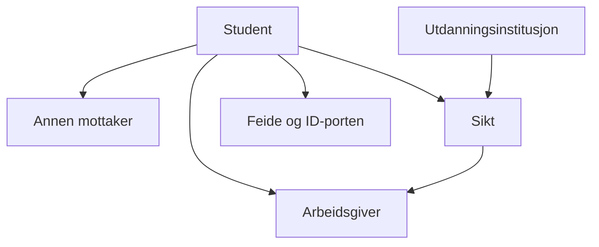
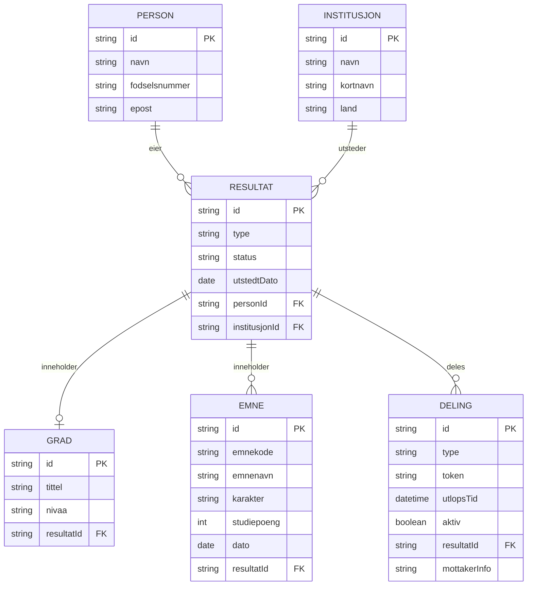
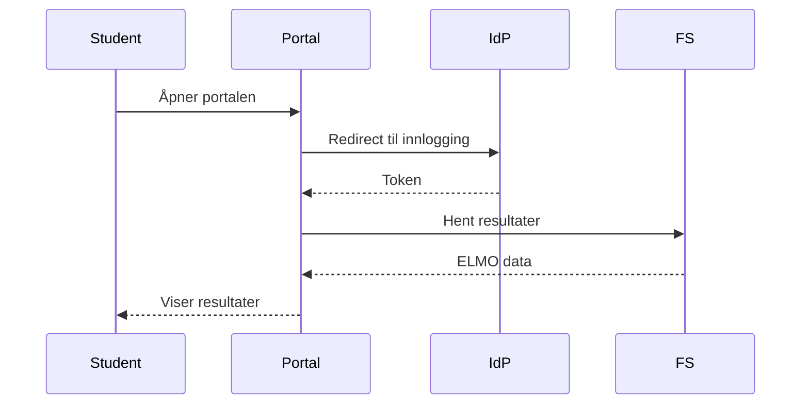
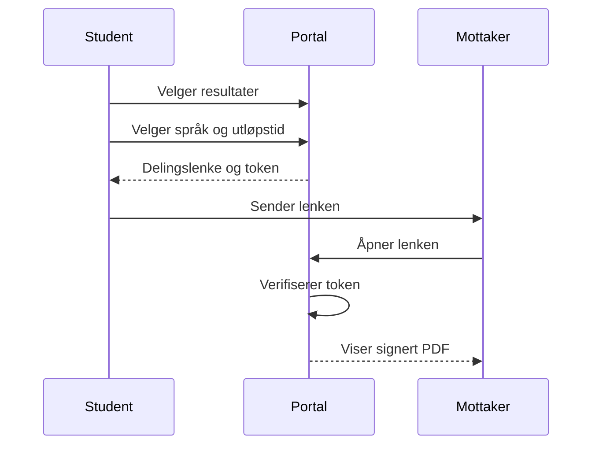
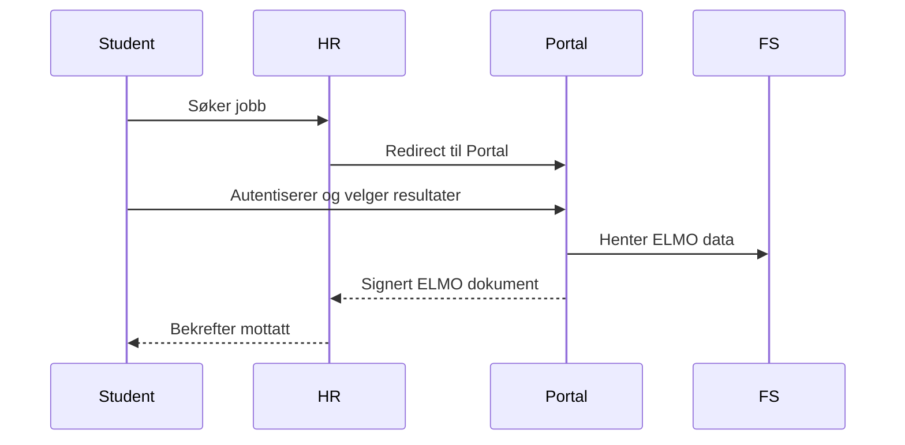
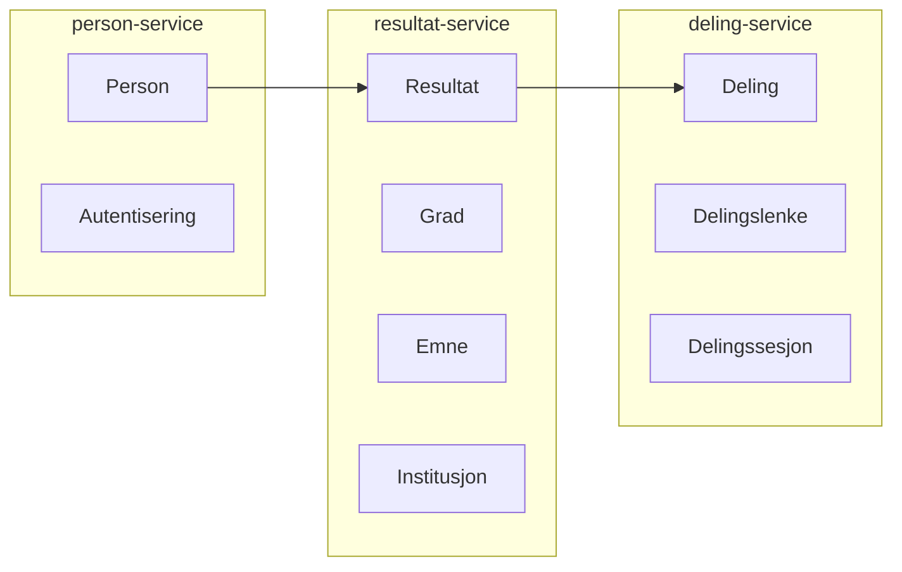
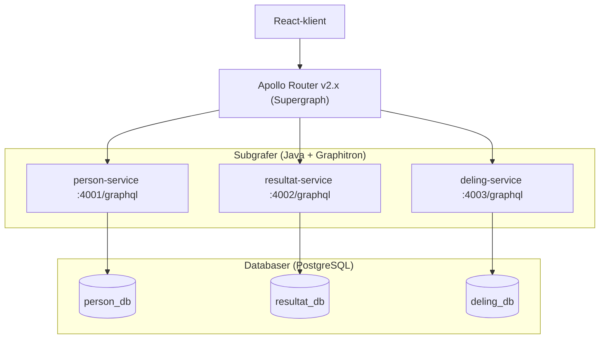

# Domenemodell – Vitnemålsportalen (forenklet)

> **Kilde:** Sikt / fellesstudentsystem.no / vitnemalsportalen.no (mars 2026)
> **Formål:** Grunnlag for å bygge en forenklet, testbar versjon av Vitnemålsportalen med Apollo Federated GraphQL, Java, og Graphitron.

---

## 1. Hva er Vitnemålsportalen?

Vitnemålsportalen er en nasjonal digital tjeneste driftet av **Sikt** (Kunnskapssektorens tjenesteleverandør). Den lar studenter hente og dele sine akademiske resultater – grader, karakterer og kompetansebevis – med arbeidsgivere, utdanningsinstitusjoner og andre.

Nøkkelprinsipper:
- **Studenten eier og kontrollerer** sine egne resultater. Kun den som har oppnådd resultatene kan dele dem.
- **Digitalt signerte dokumenter** – institusjonene signerer, mottakere kan verifisere ektheten.
- **Gratis** for alle brukere.
- Autentisering via **Feide** (utdanningskonto) eller **ID-porten** (norsk fødselsnummer).
- Dataformat: **ELMO** (basert på CEN europeisk standard).

---

## 2. Aktører (Actors)

| Aktør | Rolle | Beskrivelse |
|---|---|---|
| **Student** | Resultatseier | Personen som har oppnådd resultatene. Autentiseres via Feide/ID-porten. |
| **Utdanningsinstitusjon** | Utgiver | Universiteter, høgskoler og Kompetanse Norge. Lagrer og signerer resultater. |
| **Arbeidsgiver / HR-system** | Mottaker | Mottar delte resultater digitalt via HR-systemintegrasjon. |
| **Annen mottaker** | Mottaker | Enhver som mottar en delingslenke fra studenten. |
| **Sikt** | Tjenesteleverandør | Drifter plattformen, kobler institusjoner og brukere. |
| **Feide / ID-porten** | Identitetsleverandør | Autentisering og identitetsbekreftelse. |

---

## 3. Kjernebegreper (Ubiquitous Language)

| Begrep | Engelsk | Beskrivelse |
|---|---|---|
| **Vitnemål** | Diploma | Offisielt dokument for fullført grad/studieprogram |
| **Karakterutskrift** | Transcript of grades | Liste over alle emner og karakterer |
| **Kompetansebevis** | Certificate of competence | Bevis på oppnådd kompetanse (Kompetanse Norge) |
| **Resultat** | Result | Samlebetegnelse: vitnemål, karakterutskrift, kompetansebevis |
| **Grad** | Degree | F.eks. Bachelor, Master, PhD |
| **Emne** | Course / Subject | Enkelt fag med emnekode og karakter |
| **Karakter** | Grade | Vurdering av et emne (A-F eller bestått/ikke bestått) |
| **Institusjon** | Institution | Utdanningsinstitusjon som har utstedt resultater |
| **Delingslenke** | Sharing link | Tidsbegrenset lenke student sender til mottaker |
| **Delingssesjon** | Sharing session | Aktiv deling via HR-system/institusjon |
| **ELMO** | ELMO | Europeisk XML-format for utveksling av akademiske resultater |
| **Feide** | Feide | Norsk føderal innloggingstjeneste for utdanningssektoren |
| **ID-porten** | ID-porten | Norsk nasjonal digital ID-tjeneste |
| **FS** | Felles studentsystem | Studieadministrasjonssystem brukt av norske høyere utdanningsinstitusjoner |

---

## 4. Domeneobjekter og relasjoner

---

## 5. Prosesser

### 5.1 Hente egne resultater

### 5.2 Dele resultater via lenke

### 5.3 Dele via HR-system (systemintegrasjon)

---

## 6. Domenegrenser (Bounded Contexts)

For vår **forenklede implementasjon** deler vi domenet inn i tre subgrafer / bounded contexts:

| Subgraf | Ansvar | Teknologi |
|---|---|---|
| **person-service** | Identitet, autentisering, studentprofil | Java + Graphitron + PostgreSQL |
| **resultat-service** | Resultater, grader, emner, institusjoner | Java + Graphitron + PostgreSQL |
| **deling-service** | Delingslenker, sesjonsstyring, tokens | Java + Graphitron + PostgreSQL |

---

## 7. Teknisk arkitektur (oversikt)

**Nøkkelteknologier:**
- **Apollo Router v2.10+** (Router v1.x nådde End of Support 31. mars 2026)
- **Graphitron** (Sikt) – Maven-plugin som genererer Java-kode fra GraphQL-schema
- **graphql-java** – underliggende GraphQL-runtime for Java
- **PostgreSQL** – relasjonsdatabase
- **Feide / ID-porten** – autentisering (forenklet til JWT i demo)
- **ELMO-format** – for realistisk datautveksling (forenklet i demo)

---

## 8. Viktige forretningsregler

1. **Eierskap:** Kun studenten selv kan initiere deling av sine resultater.
2. **Utløp:** Delingslenker er tidsbegrensede og kan trekkes tilbake.
3. **Signering:** Resultater er digitalt signert av utstedende institusjon.
4. **Immutabilitet:** Utstedte resultater endres ikke – nye versjoner opprettes ved behov.
5. **Personvern:** Fødselsnummer håndteres etter GDPR – ikke eksponert i API.
6. **Språk:** Resultater kan deles på bokmål, nynorsk eller engelsk.
