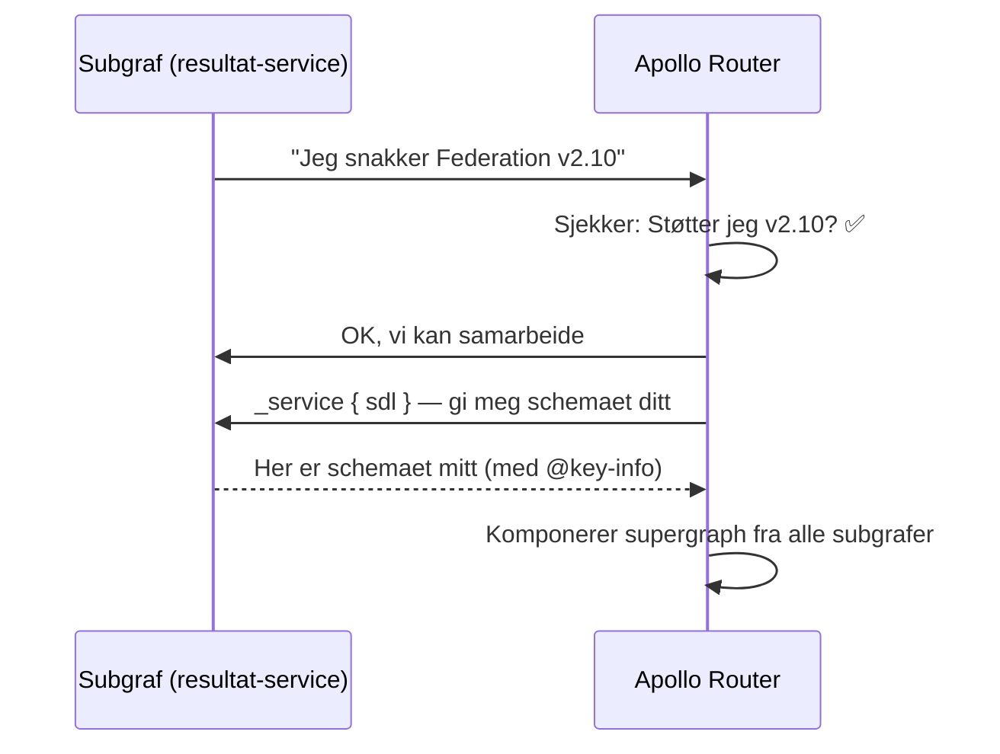
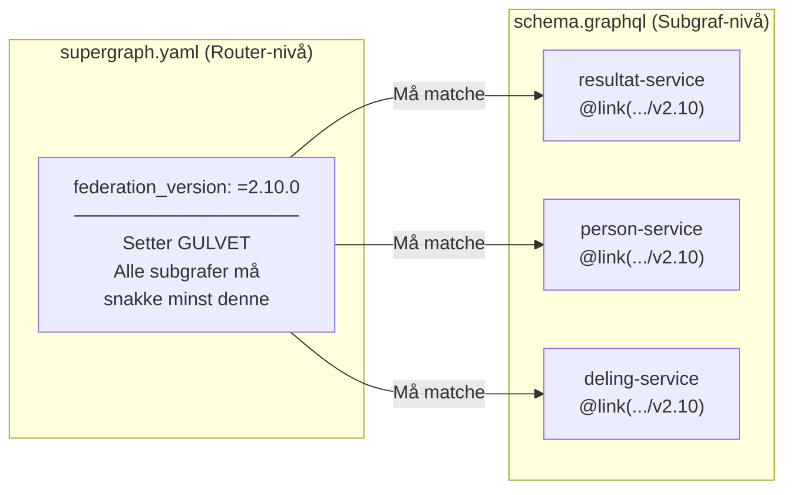
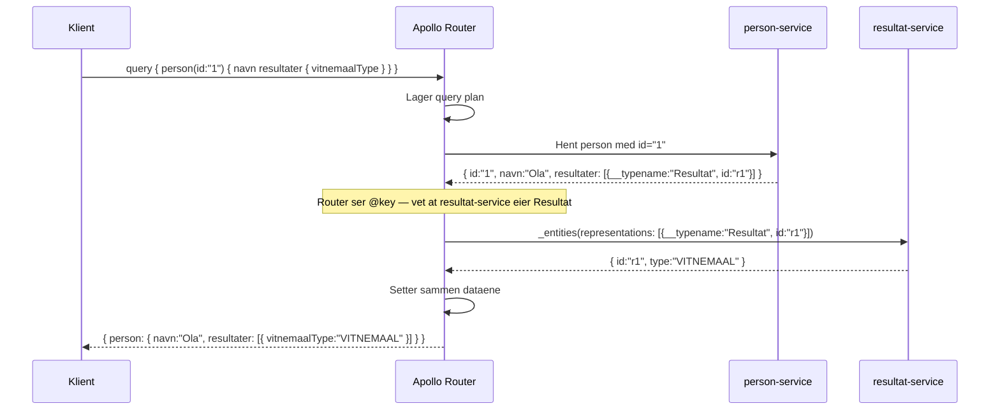
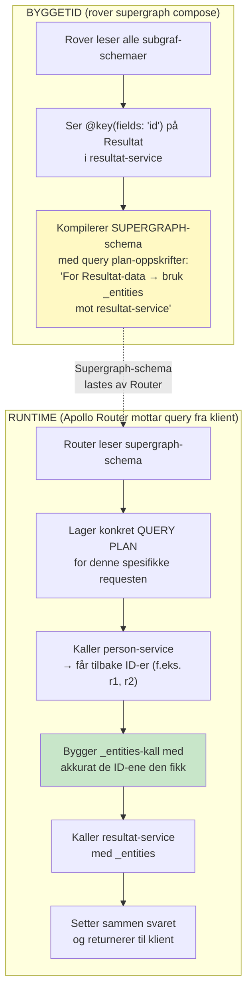
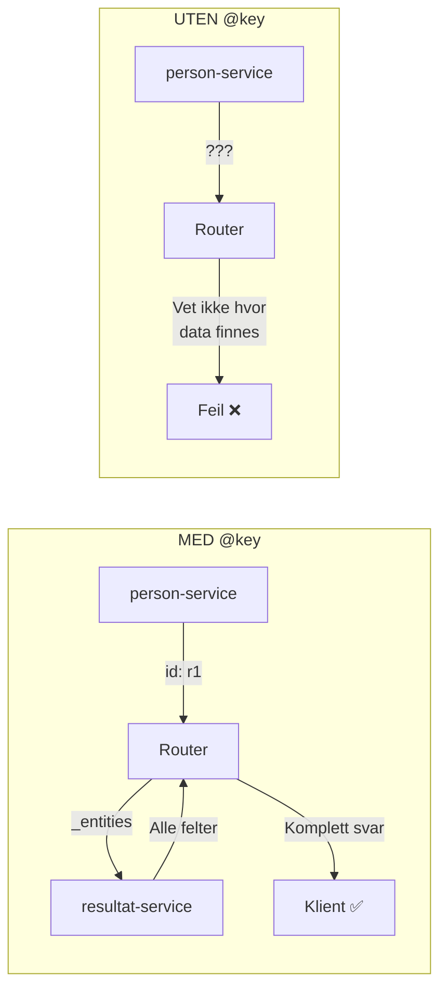
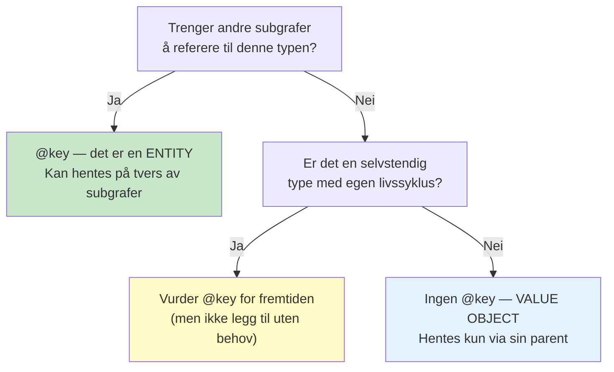
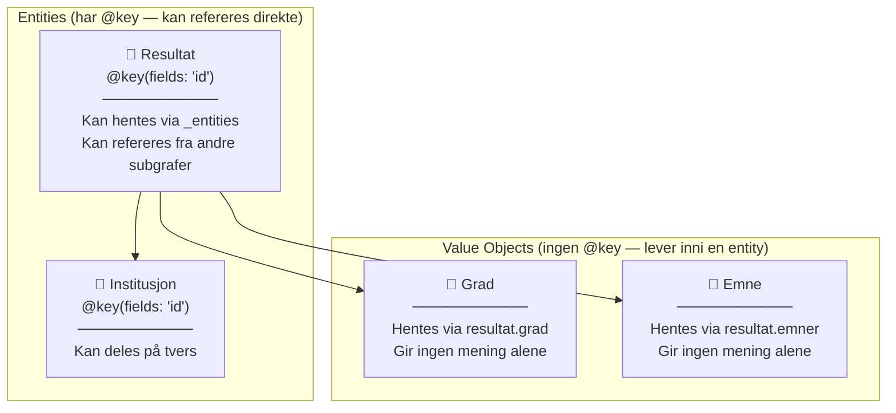
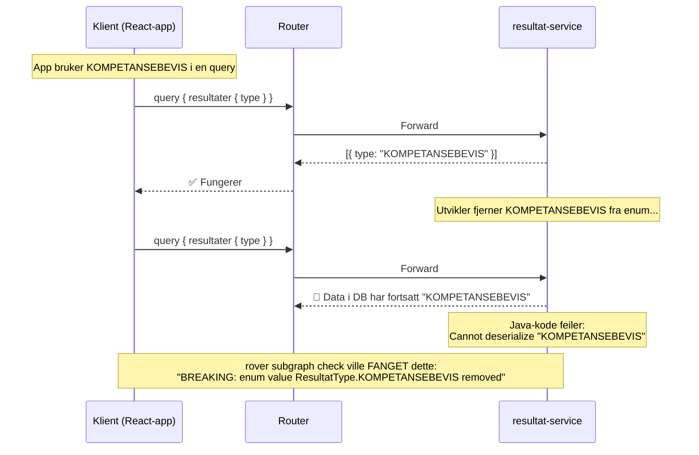
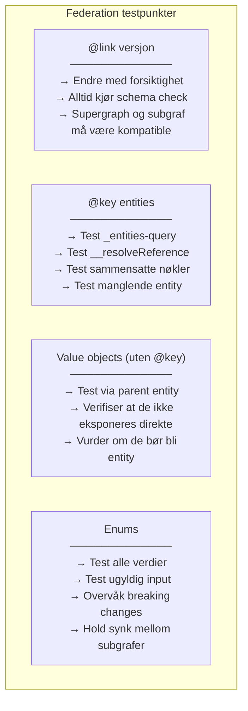

# Federation v2 – Forklaring for testere og utviklere

> **Kontekst:** Vi bruker Apollo Federation v2.10 i Vitnemålsportalen.
> Denne filen forklarer nøkkelkonseptene i schemaet vårt.

---

## 1. `extend schema @link(...)` — Hva er det og kan man ødelegge noe?

### Hva den gjør

```graphql
extend schema @link(url: "https://specs.apollo.dev/federation/v2.10", import: ["@key"])
```

Denne linjen sier: *"Denne subgrafen snakker Federation v2.10-protokollen"*.

Tenk på det som en **handshake** mellom subgrafen og Apollo Router:



### Hvor styres versjonen?

Versjonen settes på **to steder** som må være kompatible:



**Supergraph-versjonen bestemmer.** Den setter minimum — alle subgrafer må snakke en kompatibel versjon.

### Kompatibilitetseksempler

```
supergraph.yaml: federation_version: =2.10.0

resultat-service: @link(.../v2.10)   ← ✅ Eksakt match
person-service:   @link(.../v2.10)   ← ✅ Eksakt match
deling-service:   @link(.../v2.11)   ← ✅ Nyere minor er OK

deling-service:   @link(.../v2.7)    ← ⚠️ Eldre — kan feile hvis
                                         supergraph bruker v2.10-features

deling-service:   @link(.../v1.0)    ← 🔴 Helt annen syntaks — feiler
```

### Hva skjer konkret ved mismatch?

```bash
# Subgraf sier v2.10, men bruker @override som kom i v2.7
# og supergraph er satt til v2.5:

$ rover supergraph compose --config supergraph.yaml

error[E029]: Encountered composition error trying to compose the supergraph.
Caused by:
    DIRECTIVE_DEFINITION_INVALID — @override is not available in v2.5.
    Upgrade federation_version to at least =2.7.0

# Løsning: Oppdater federation_version i supergraph.yaml
```

### Kan man ødelegge noe ved å endre versjonen?

**Ja — dette er en kontrollert handling.** Her er risikobildet:

| Endring | Risiko | Eksempel |
|---|---|---|
| v2.10 → v2.10 (ingen endring) | ✅ Ingen | — |
| v2.9 → v2.10 (minor opp) | ⚠️ Lav | Nye direktiver tilgjengelig, gamle funker fortsatt |
| v2.10 → v2.11 (minor opp) | ⚠️ Lav | Bakoverkompatibelt, men test alltid |
| v2.x → v3.0 (major opp) | 🔴 Høy | Breaking changes mulig |
| v2.10 → v1.0 (nedgradering) | 🔴 Høy | v1 bruker helt annen syntaks (`@key` uten `@link`) |
| Fjerne linjen helt | 🔴 Kritisk | Subgrafen er ikke lenger en Federation-subgraf |

### Hva bør testes ved versjonsendring?

```
Testscenario: Endring av Federation-versjon
─────────────────────────────────────────────
1. ☐ rover subgraph check — passerer den fortsatt?
2. ☐ rover supergraph compose — komponerer alle subgrafer?
3. ☐ Starter subgrafen uten feil?
4. ☐ _service { sdl } — returnerer korrekt schema?
5. ☐ _entities-query — fungerer entity resolution fortsatt?
6. ☐ Cross-subgraf queries — fungerer de i supergraph?
```

### Tommelfingerregel

> **Endre aldri Federation-versjon uten å kjøre schema checks i CI.**
> Behandle det som en infrastrukturendring, ikke en kodeendring.

---

## 2. `@key(fields: "id")` — Entities forklart

### Hva er en entity?

En **entity** er en type som kan deles mellom subgrafer. Den har en "primærnøkkel" (`@key`) slik at andre subgrafer kan referere til den.

```graphql
type Resultat @key(fields: "id") {
  id: ID!
  # ... resten av feltene
}
```

Dette sier: *"Hvis du kjenner `id`-en til et Resultat, kan du be meg om resten av dataene."*

### Hvordan fungerer det i praksis?

Tenk deg at `person-service` vet at en person har resultater, men den eier ikke resultat-dataene. Flyten ser slik ut:



**Nøkkelpoenget:** `person-service` returnerer bare `id` + `__typename` for resultater. Apollo Router bruker `@key` for å vite *hvor* den skal hente resten.

### `_entities`-queryen — hjertet av Federation

Hver subgraf med entities eksponerer automatisk `_entities`-queryen. Det er en innebygd "oppslagsmekanisme" — du skriver den ikke selv, den finnes automatisk fordi du har `@key`.

Her er et eksempel på hvordan man kan **teste** den manuelt:

```graphql
# _entities-queryen genereres automatisk av Federation.
# Dataene under (id: "r1", id: "r2") er EKSEMPELDATA for testing —
# de er IKKE en del av den genererte queryen.
# I produksjon er det Apollo Router som fyller inn ID-ene dynamisk.
query TestEntityResolution {
  _entities(representations: [
    { __typename: "Resultat", id: "r1" },
    { __typename: "Resultat", id: "r2" }
  ]) {
    ... on Resultat {
      type
      institusjon { navn }
      emner { emnekode }
    }
  }
}
```

### Hvem gjør hva? Byggetid vs. runtime

Det er viktig å forstå at `_entities` involverer **tre aktører** på ulike tidspunkter:



```
Oppsummert:
─────────────
• ROVER (byggetid):       Kompilerer reglene — "HVORDAN kan data hentes?"
• SUPERGRAPH-SCHEMA:      Inneholder reglene — "oppskriftsboken"
• APOLLO ROUTER (runtime): Følger reglene — "bygger _entities-kall med konkrete ID-er"
• SUBGRAFEN:               Vet ingenting om alt dette — den bare svarer på _entities
```

### Hva vet subgrafen?

Subgrafen vet **ingenting** om supergraphen eller Router. Den vet bare:

> "Jeg har en `_entities`-resolver. Hvis noen gir meg `{__typename: "Resultat", id: "r1"}`, slår jeg opp det resultatet i min database og returnerer det."

Den behandler `_entities` som en helt vanlig query — den vet ikke hvem som kaller den eller hvorfor. Det er det som gjør Federation elegant: subgrafene er uavhengige og kan testes isolert.

**For testing er dette kritisk:** Hvis `_entities` ikke fungerer, feiler ALL cross-subgraf kommunikasjon. Og fordi subgrafen ikke vet om konteksten, kan du teste `_entities` direkte mot subgrafen uten å trenge Router.

> **Risikoanalyse og testscenarier for `_entities` finnes i [teststrategi.md](teststrategi.md) under «Risikoanalyse: Entity Resolution».**

---

### Sammensatte nøkler — @key med flere felt

`@key` trenger ikke være bare `id`. Du kan bruke sammensatte nøkler:

```graphql
# Enkel nøkkel (vårt tilfelle)
type Resultat @key(fields: "id") {
  id: ID!
}

# Sammensatt nøkkel — identifisert av to felt
type Emne @key(fields: "emnekode institusjonId") {
  emnekode: String!
  institusjonId: ID!
}

# Flere nøkler — kan finnes via ENTEN id ELLER emnekode+institusjon
type Emne @key(fields: "id") @key(fields: "emnekode institusjonId") {
  id: ID!
  emnekode: String!
  institusjonId: ID!
}
```

Vi bruker ikke sammensatte nøkler nå, men det er nyttig å vite at det finnes.

### Hva skjer hvis @key mangler?



Uten `@key` kan ikke Router koble data på tvers — den vet ikke hvordan den skal "slå opp" et Resultat i en annen subgraf.

---

## 3. Hvorfor har Institusjon `@key`, men ikke Grad og Emne?

### Beslutningstreet



### Våre typer:

| Type | `@key`? | Hvorfor |
|---|---|---|
| **Resultat** | ✅ `@key(fields: "id")` | `deling-service` trenger å referere til resultater. `person-service` trenger å koble person → resultater. |
| **Institusjon** | ✅ `@key(fields: "id")` | Kan deles av flere subgrafer. `person-service` kan trenge institusjonsinfo. En institusjon eksisterer uavhengig av et resultat. |
| **Grad** | ❌ | Eksisterer *kun* som del av et Resultat. Ingen annen subgraf trenger å hente en grad alene. Alltid hentet via `resultat.grad`. |
| **Emne** | ❌ | Samme som Grad — alltid hentet via `resultat.emner`. Et emne gir ingen mening uten sitt resultat. |

### Visuelt: Entity vs. Value Object



### Analogi

Tenk på det som en postadresse:
- **Resultat** og **Institusjon** = bygninger med eget gatenummer → du kan finne dem direkte
- **Grad** og **Emne** = rom inni en bygning → du finner dem kun via bygningen de tilhører

### Når bør en value object bli en entity?

```
Spør deg selv:
──────────────
1. Trenger en ANNEN subgraf å hente denne typen direkte?  → Legg til @key
2. Har typen en egen livssyklus (opprettes/slettes uavhengig)?  → Vurder @key
3. Brukes typen KUN som et felt på en annen type?  → Behold som value object

Eksempel fra vår verden:
  Emne er value object NÅ.
  Men hvis vi senere bygger en "emne-katalog-service" som eier alle emner,
  da ville Emne bli en entity med @key(fields: "emnekode").
```

---

## 4. Enums — Faste verdier

```graphql
enum ResultatType {
  VITNEMAAL
  KARAKTERUTSKRIFT
  KOMPETANSEBEVIS
}

enum ResultatStatus {
  GYLDIG
  TRUKKET_TILBAKE
  UNDER_BEHANDLING
}
```

### Hva er en enum i GraphQL?

Samme konsept som Java enum: et **lukket sett med gyldige verdier**. Klienten kan ikke sende vilkårlige strenger — bare verdiene definert i enum.

### Enum i GraphQL vs. Java — sammenligning

```
GraphQL schema:                    Java-kode (generert eller manuell):
─────────────────                  ────────────────────────────────────
enum ResultatType {                public enum ResultatType {
  VITNEMAAL          ←──────→          VITNEMAAL,
  KARAKTERUTSKRIFT   ←──────→          KARAKTERUTSKRIFT,
  KOMPETANSEBEVIS    ←──────→          KOMPETANSEBEVIS
}                                  }
```

De to må holdes i synk. Graphitron kan generere Java-enums fra GraphQL-schema automatisk.

### Hvorfor er enums viktig for testing?

```
Testregler for enums:
─────────────────────
✅ Test at alle enum-verdier håndteres (switch/match skal dekke alle)
✅ Test at ugyldig verdi gir GraphQL-valideringsfeil (ikke 500)
⚠️ Å LEGGE TIL en ny enum-verdi er TRYGT (additivt)
🔴 Å FJERNE en enum-verdi er en BREAKING CHANGE
🔴 Å ENDRE NAVN på en enum-verdi er en BREAKING CHANGE
```

### Eksempel: Hva skjer ved ugyldig enum?

```graphql
# Klienten sender:
query {
  resultater(type: UGYLDIG_VERDI) { id }
}

# GraphQL svarer automatisk (uten at vi skriver kode):
{
  "errors": [{
    "message": "Value 'UGYLDIG_VERDI' is not a member of enum 'ResultatType'"
  }]
}
```

### Eksempel: Breaking change med enum



### Enums i Federation — delt mellom subgrafer

Enums kan brukes av flere subgrafer. Hvis `deling-service` også trenger `ResultatType`, definerer den samme enum:

```graphql
# I resultat-service (eier):
enum ResultatType {
  VITNEMAAL
  KARAKTERUTSKRIFT
  KOMPETANSEBEVIS
}

# I deling-service (bruker):
# Definerer SAMME enum — Apollo Router verifiserer at de matcher
enum ResultatType {
  VITNEMAAL
  KARAKTERUTSKRIFT
  KOMPETANSEBEVIS
}
```

Hvis verdiene ikke matcher, feiler `rover supergraph compose`.

---

## 5. `import: ["@key"]` — Hva kan importeres?

Vi importerer kun `@key` nå, men Federation v2.10 har flere direktiver:

```graphql
# Vårt schema nå — kun @key:
extend schema @link(url: "https://specs.apollo.dev/federation/v2.10", import: ["@key"])

# Eksempel med flere imports (vi legger til når vi trenger dem):
extend schema @link(url: "https://specs.apollo.dev/federation/v2.10",
  import: ["@key", "@shareable", "@external", "@requires", "@provides", "@override"])
```

### De viktigste direktivene

| Direktiv | Hva det gjør | Når vi trenger det |
|---|---|---|
| `@key` | Markerer en entity med primærnøkkel | Nå — Resultat og Institusjon |
| `@external` | "Dette feltet eies av en annen subgraf" | Fase 3 — når person-service refererer til Resultat |
| `@requires` | "Jeg trenger disse feltene for å beregne mitt felt" | Sjelden — avansert bruk |
| `@shareable` | "Flere subgrafer kan returnere dette feltet" | Når to subgrafer har overlappende data |
| `@override` | "Jeg tar over dette feltet fra en annen subgraf" | Ved migrasjon mellom subgrafer |
| `@provides` | "Jeg kan også levere disse feltene fra en annen entity" | Ytelsesoptimalisering |

Vi legger til imports etter hvert som vi trenger dem — ikke importer alt på forhånd.

---

## Oppsummering — Hva må testes?


