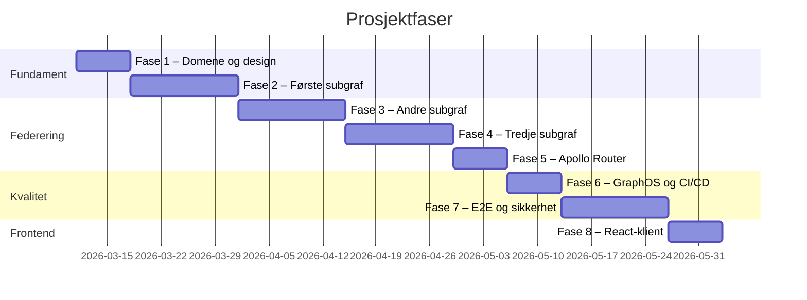
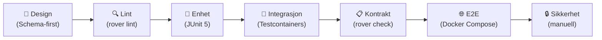

# Prosjektplan – Forenklet Vitnemålsportalen

> **Rolle:** Du (brukeren) er lærling. Claude er testleder og mentor. Vi bygger steg for steg.
> **Filosofi:** Lær ved å gjøre. Ingenting nytt steg før forrige er forstått.
> **Prinsipp:** API-first + testbarhet fra dag én.

---

## Teknisk stack (2026)

| Komponent | Teknologi | Versjon |
|---|---|---|
| API Gateway | Apollo Router | v2.10+ (LTS) |
| Subgrafer | Java + Graphitron (Sikt) + graphql-java | Siste stabile |
| Database | PostgreSQL | 16+ |
| Frontend | React + Apollo Client | (minimal, ikke fokus) |
| Schema registry | Apollo GraphOS | Free tier |
| CI/CD | GitHub Actions + Rover CLI | Siste stabile |
| Testing (Java) | JUnit 5 + AssertJ + Testcontainers | - |
| Testing (GraphQL) | Apollo Sandbox + Rover CLI | - |

---

## Faseoversikt



---

## Fase 1 – Domene, GraphQL-grunnlag og prosjektoppsett

**Mål:** Forstå hva vi bygger. Sette opp prosjektstrukturen. Skrive første GraphQL-schema for hånd.

**Hva vi gjør:**
1. Lese og diskutere `domene.md` – forstå alle begreper
2. Lære GraphQL SDL (Schema Definition Language) grunnleggende
3. Skrive schema for `resultat-service` *for hånd* (uten Graphitron) – forstå hvordan det ser ut
4. Sette opp Maven multi-modul prosjektstruktur
5. Koble til Apollo GraphOS (gratis) og registrere schema

**Læringsmål for lærlingen:**
- Hva er en GraphQL type, query, mutation, subscription?
- Hva er `@key` i Federation-sammenheng?
- Hva er forskjellen på SDL og resolver?

**Testaktiviteter i denne fasen:**
- Statisk schema-validering med `rover subgraph lint`
- Gjennomgang av schema i Apollo Sandbox (introspeksjon lokalt)

**Ferdigkriterium:** Lærlingen kan forklare domenet og skrive et enkelt GraphQL-schema fra bunnen.

---

## Fase 2 – Første subgraf: `resultat-service`

**Mål:** Bygge og teste en komplett, isolert subgraf med Graphitron.

**Hva vi gjør:**
1. Installere og konfigurere Graphitron Maven-plugin
2. Designe PostgreSQL-skjema for resultater/emner/grader
3. La Graphitron generere Java-datafetchere fra GraphQL-schema
4. Implementere manglende logikk (det Graphitron ikke genererer)
5. Starte subgrafen lokalt og teste i Apollo Sandbox

**Graphitron-begreper vi lærer:**
- Hva er en datafetcher / resolver i graphql-java?
- Hva genererer Graphitron automatisk vs. hva skriver vi selv?
- Hvordan kobler Graphitron schema til databasemodell?

**Testaktiviteter:**
```
Lag 1 – Enhetstest (JUnit 5)
  ├── Test datafetcher-logikk isolert (mock database)
  ├── Test domenelogikk (forretningsregler)
  └── Test feilhåndtering (ugyldig input, ikke funnet)

Lag 2 – Integrasjonstest (Testcontainers)
  ├── Start ekte PostgreSQL i Docker
  ├── Kjør GraphQL-queries mot subgraf via executeOperation()
  ├── Test _entities-query for alle @key-varianter
  └── Test _service { sdl }-feltet
```

**Ferdigkriterium:** Lærlingen kan kjøre `query { resultater { id vitnemaalType } }` og forklare hva som skjer i hvert lag.

---

## Fase 3 – Andre subgraf: `person-service`

**Mål:** Lære entity references – hvordan subgrafer snakker med hverandre.

**Hva vi gjør:**
1. Bygge `person-service` med Person-entity og `@key(fields: "id")`
2. Referere til Person fra `resultat-service` med `@key`-stub
3. Forstå `__resolveReference` – den viktigste resolveren i federation

**Kjernekonsept vi lærer:**
- Hva skjer når Apollo Router trenger data fra to subgrafer?
- Hva er en query plan?
- Hva er N+1-problemet og DataLoader?

**Testaktiviteter:**
```
Lag 1 – Enhetstest
  └── Test __resolveReference isolert med mock

Lag 2 – Integrasjonstest
  └── Test _entities-query:
      query { _entities(representations: [{__typename:"Person", id:"1"}]) { ...on Person { navn } } }

Kontrakt-validering
  └── rover subgraph check – verifiser at begge subgrafer komponerer
```

**Ferdigkriterium:** Lærlingen kan tegne opp hva som skjer i en federated query som spenner to subgrafer.

---

## Fase 4 – Tredje subgraf: `deling-service`

**Mål:** Legge til mutations og mer kompleks forretningslogikk.

**Hva vi gjør:**
1. Bygge `deling-service` med mutations (opprett/trekk tilbake deling)
2. Lære GraphQL mutation best practices (union return types for feil)
3. Generere tokens og tidsbegrensede lenker

**Schema-mønster vi lærer:**
```graphql
# God praksis: union return type for mutations
union OpprettDelingResult = Deling | ValideringsFeil | ResultatIkkeFunnetFeil

type Mutation {
  opprettDeling(input: OpprettDelingInput!): OpprettDelingResult!
  trekkTilbakeDeling(id: ID!): TrekkTilbakeResult!
}
```

**Testaktiviteter:**
```
Lag 1 – Enhetstest
  ├── Test alle mutation-paths (happy path + alle feiltilfeller)
  └── Test token-generering og utløpslogikk

Lag 2 – Integrasjonstest
  ├── Opprett deling → verifiser i DB → hent via query
  └── Trekk tilbake → verifiser at deling ikke lenger er aktiv

Lag 3 – Kontraktstest
  └── rover subgraph check mot alle tre subgrafer
```

**Ferdigkriterium:** Lærlingen kan skrive en mutasjon med union result type og teste alle utfall.

---

## Fase 5 – Apollo Router: Sette opp supergraph

**Mål:** Koble alle tre subgrafer til Apollo Router og kjøre federated queries.

**Hva vi gjør:**
1. Sette opp `router.yaml` med alle tre subgrafer
2. Konfigurere `rover supergraph compose` lokalt
3. Kjøre første cross-subgraf query i Apollo Sandbox
4. Lese og forstå query plans

**Eksempel federated query vi tester:**
```graphql
# Spenner alle tre subgrafer
query MinResultatOversikt {
  person(id: "student-1") {
    navn
    resultater {
      id
      vitnemaalType
      institusjon { navn }
      emner { emnekode karakter }
      aktiveDelinger {
        token
        utlopsTid
      }
    }
  }
}
```

**Testaktiviteter:**
```
E2E-test (lokalt)
  ├── Start alle tre subgrafer + Router med Docker Compose
  ├── Kjør supergraph queries i Apollo Sandbox
  ├── Inspiser query plan i Apollo Studio
  └── Verifiser at feil i én subgraf gir partial response
```

**Ferdigkriterium:** Lærlingen kan starte hele stacken lokalt og kjøre queries mot supergraphen.

---

## Fase 6 – Apollo GraphOS og CI/CD

**Mål:** Industriell schema-kvalitetssikring med Rover CLI og GitHub Actions.

**Hva vi gjør:**
1. Sette opp GitHub Actions pipeline
2. Integrere `rover subgraph check` i PR-pipeline
3. Konfigurere schema linting-regler
4. Se breaking change detection i praksis – bryt noe med vilje!

**Pipeline vi bygger:**
```yaml
# PR-pipeline (forenklet)
jobs:
  schema-check:
    steps:
      - rover subgraph lint --schema ./schema.graphql
      - rover subgraph check my-graph@current --schema ./schema.graphql --name resultat-service

  test:
    steps:
      - mvn test  # enhetstester
      - mvn verify -P integration  # integrasjonstester med Testcontainers
```

**Testaktiviteter:**
- Bevisst introduser en breaking change → se CI feile → forstå meldingen
- Legg til et nytt felt (additivt) → se CI passere
- Øv på å lese `rover subgraph check`-output

**Ferdigkriterium:** Lærlingen kan forklare hva schema checks gjør og tolke output fra Rover.

---

## Fase 7 – E2E, sikkerhet og observabilitet

**Mål:** Lære sikkerhetstesting og observabilitet for GraphQL.

**Hva vi gjør:**

**Sikkerhet:**
1. Konfigurere query depth limits i `router.yaml`
2. Verifisere at subgrafer IKKE er tilgjengelig direkte utenfra
3. Teste at `_entities`-query ikke er eksponert via Router
4. Deaktivere introspeksjon i "prod"-modus

**Angrepsvektorer vi tester:**
```graphql
# Dybde-angrep – skal avvises av Router
query DybdeAngrep {
  person(id:"1") { resultater { person { resultater { person { resultater { emner { emnekode } } } } } } }
}

# _entities eksponert? Skal FEILE mot Router, kun internt:
query { _entities(representations:[{__typename:"Person",id:"1"}]) { ...on Person { navn } } }
```

**Observabilitet:**
1. Aktivere OpenTelemetry i Router og subgrafer
2. Se traces i Apollo Studio (eller Jaeger lokalt)
3. Lese field-level usage metrics

**Ferdigkriterium:** Lærlingen kan identifisere og verifisere de viktigste sikkerhetstiltakene for en federated graph.

---

## Fase 8 – React-klient (minimal)

**Mål:** Se at GraphQL fungerer fra frontend. Ikke fokus, men nyttig for å se helheten.

**Hva vi gjør:**
1. Sette opp Apollo Client i React
2. Skrive to-tre queries og én mutasjon
3. Se nettverkstrafikk i browser devtools

**Ferdigkriterium:** Lærlingen ser at det samme schema brukes fra frontend som vi testet i Sandbox.

---

## Kvalitetsprinsipper gjennom alle faser



### Test-pyramide for federated GraphQL

```
         /\
        /E2E\        ← Få, langsomme, høy verdi
       /------\
      /Kontrakt\     ← rover subgraph check (CI)
     /----------\
    / Integrasjon\   ← Testcontainers + _entities
   /--------------\
  /  Enhetstester  \ ← JUnit 5 + mock (mange, raske)
 /------------------\
```

---

## Neste steg

Vi starter med **Fase 1**. Første oppgave for lærlingen:

> Les `domene.md` og svar på: Hva er forskjellen på et vitnemål og en karakterutskrift? Hvem er aktørene? Hva skjer når en student deler via lenke?

Når du har forstått domenet, begynner vi å skrive GraphQL-schema.
