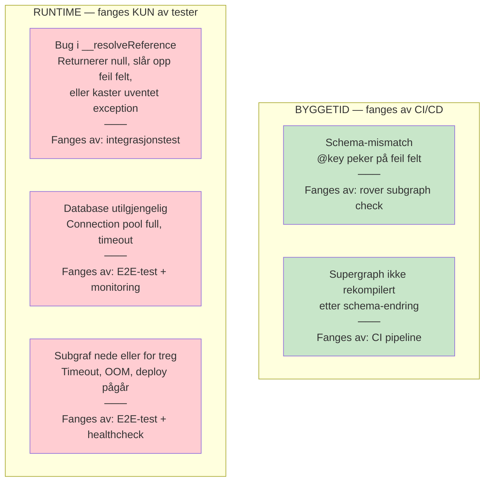
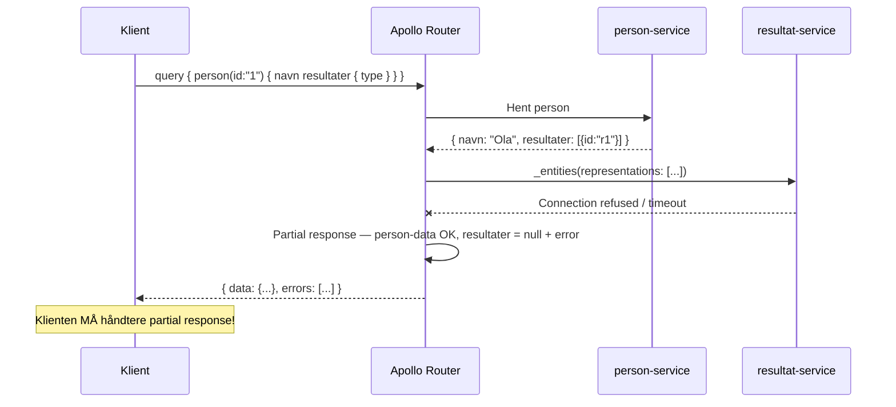

# Teststrategi – Forenklet Vitnemålsportalen

> **Kontekst:** API-first, federated Apollo GraphQL med Java/Graphitron subgrafer.
> **Prinsipp:** Shift left – kvalitet inn tidligst mulig, ikke som etterpåklokskap.

---

## Testmål

1. **Korrekthet** – GraphQL-schema og resolvers returnerer riktige data
2. **Kontraktsintegritet** – Subgrafer komponerer til et gyldig supergraph
3. **Isolasjon** – Feil i én subgraf propagerer ikke ukontrollert
4. **Sikkerhet** – API-et avviser ondsinnede queries og beskytt sensitive data
5. **Sporbarhet** – Vi kan se hva som skjer i en query på tvers av subgrafer

---

## Test-pyramide

```
               ┌─────────┐
               │   E2E   │  2-5 tester per brukerscenario
               │  Tests  │  Verktøy: Docker Compose + Apollo Sandbox
               └────┬────┘
          ┌─────────┴─────────┐
          │  Kontrakt / Schema │  En per subgraf per PR
          │      Checks        │  Verktøy: rover subgraph check
          └────────┬───────────┘
       ┌───────────┴───────────┐
       │  Integrasjonstester   │  10-30 per subgraf
       │  (Testcontainers)     │  Verktøy: JUnit 5 + Testcontainers
       └──────────┬────────────┘
    ┌─────────────┴─────────────┐
    │      Enhetstester          │  50-200 per subgraf
    │  (JUnit 5 + mock)          │  Verktøy: JUnit 5 + Mockito + AssertJ
    └────────────────────────────┘
```

---

## Testnivåer i detalj

### Nivå 1: Enhetstester (JUnit 5)

**Hva testes:** Resolver/datafetcher-logikk isolert fra infrastruktur.

**Verktøy:**
- JUnit 5 + AssertJ
- Mockito (mock database-lag)
- `@faker-js/faker`-ekvivalent i Java: JavaFaker / Instancio

**Hva MÅ enhetstestes:**
```
✅ __resolveReference for alle entity-typer (kritisk i federation!)
✅ Alle datafetchere med happy path
✅ Alle datafetchere med feiltilfeller (ikke funnet, ugyldig input)
✅ Domenelogikk (f.eks. er delingslenke utløpt?)
✅ Token-generering og validering
✅ Input-validering
```

**Eksempel (Java / JUnit 5):**
```java
@Test
void resolveReference_returnererPerson_naarPersonFinnes() {
    // Arrange
    var person = new Person("1", "Ola Nordmann", "ola@test.no");
    when(personRepository.findById("1")).thenReturn(Optional.of(person));

    // Act
    var result = personDataFetcher.resolveReference(Map.of("id", "1"));

    // Assert
    assertThat(result).isNotNull();
    assertThat(result.navn()).isEqualTo("Ola Nordmann");
}

@Test
void resolveReference_kasterFeil_naarPersonIkkeFinnes() {
    when(personRepository.findById("999")).thenReturn(Optional.empty());

    assertThatThrownBy(() -> personDataFetcher.resolveReference(Map.of("id", "999")))
        .isInstanceOf(GraphQLException.class)
        .hasMessageContaining("Person ikke funnet");
}
```

---

### Nivå 2: Integrasjonstester (Testcontainers)

**Hva testes:** En subgraf mot ekte database, via GraphQL-query.

**Verktøy:**
- JUnit 5 + Testcontainers (PostgreSQL)
- graphql-java `GraphQL.execute()` eller HTTP-klient mot subgraf
- Flyway/Liquibase for testdata-migrasjoner

**Hva MÅ integrasjonstestes:**
```
✅ _entities-query for ALLE @key-varianter
✅ _service { sdl } – skjema eksponeres korrekt
✅ Queries: happy path mot ekte DB
✅ Mutations: opprett → hent → verifiser i DB
✅ Mutations: feiltilfeller (fk-feil, duplikat, etc.)
✅ Paginering (hvis implementert)
```

**Kritisk: _entities-test (entity resolution):**
```graphql
# Denne queryen er hjørnesteinen i Federation-testing
# Tester at subgrafen kan løse opp en entity fra en @key
query TestEntityResolution($representations: [_Any!]!) {
  _entities(representations: $representations) {
    ... on Resultat {
      id
      vitnemaalType
      institusjon { navn }
    }
  }
}
# Variables:
# { "representations": [{ "__typename": "Resultat", "id": "resultat-1" }] }
```

**Testcontainers-oppsett (Java):**
```java
@Testcontainers
class ResultatServiceIntegrationTest {
    @Container
    static PostgreSQLContainer<?> postgres =
        new PostgreSQLContainer<>("postgres:16")
            .withDatabaseName("resultat_db")
            .withInitScript("test-data.sql");

    @Test
    void hentResultat_returnererKorrekteEmner() {
        var result = graphQL.execute("""
            query {
              resultat(id: "r1") {
                id
                emner { emnekode karakter studiepoeng }
              }
            }
        """);

        assertThat(result.getErrors()).isEmpty();
        var data = (Map<?,?>) result.getData();
        // ... assertions
    }
}
```

---

### Risikoanalyse: Entity Resolution (`_entities`)

Entity resolution er **hjertet av Federation** — hvis det feiler, bryter all cross-subgraf kommunikasjon. Vi må forstå hva som kan gå galt og når vi fanger det.

#### Feilkategorier



**Nøkkelinnsikt:** Schema checks (`rover subgraph check`) fanger byggetidsfeil, men **ikke runtime-feil**. Det er derfor integrasjonstester mot `_entities` er ufravikelig — de er den eneste måten å verifisere at resolveren fungerer mot ekte data.

#### Sannsynlighet og konsekvens

| Feiltype | Sannsynlighet | Konsekvens | Hvordan fange |
|---|---|---|---|
| Bug i `__resolveReference` | **Medium** — vanlig ved nye entities eller refaktorering | Hele cross-subgraf-flyten bryter | Integrasjonstest med Testcontainers |
| Schema-mismatch | **Lav** med CI — **Høy** uten | Supergraph kompilerer ikke | `rover subgraph check` i PR-pipeline |
| Subgraf nede | **Lav** i prod med god infra | Partial response (se under) | E2E-test + healthcheck + alerting |
| Database-feil | **Lav** | `_entities` returnerer errors | Integrasjonstest + monitoring |

#### Partial response — Federation sin «graceful degradation»

Når en subgraf feiler, returnerer Router **delvis data + feilmelding** i stedet for å feile helt:

```json
// Eksempel: resultat-service er nede, men person-service fungerer
{
  "data": {
    "person": {
      "navn": "Ola Nordmann",
      "resultater": null
    }
  },
  "errors": [
    {
      "message": "Could not resolve entities from subgraph 'resultat-service'",
      "path": ["person", "resultater"]
    }
  ]
}
```



#### Testscenarier for partial response

```
Scenario: Subgraf nede
  Given: person-service kjører, resultat-service er NEDE
  When:  query { person(id:"1") { navn resultater { type } } }
  Then:  person.navn returneres korrekt
  And:   person.resultater er null
  And:   errors[] inneholder feilmelding med path ["person","resultater"]

Scenario: Subgraf timeout
  Given: resultat-service svarer etter 30 sekunder (over timeout-grense)
  When:  query som spenner begge subgrafer
  Then:  Partial response med timeout-feilmelding

Scenario: Entity ikke funnet
  Given: person-service returnerer resultat-ID som ikke finnes i resultat-service
  When:  Router kaller _entities med ukjent ID
  Then:  null for det resultatet + feilmelding (IKKE 500-feil)
```

> **Som testleder:** Partial response er et **viktig testområde** som ofte overses.
> Klienten (React-appen) MÅ håndtere at deler av svaret kan være `null` med errors.
> Test dette tidlig — ikke vent til Fase 7.

---

### Nivå 3: Kontrakt / Schema Checks

**Hva testes:** Subgrafenes schema kan kombineres til et gyldig supergraph. Endringer bryter ikke eksisterende klienter.

**Verktøy:** Rover CLI + Apollo GraphOS

**Sjekker som kjøres automatisk:**

| Sjekk | Hva den gjør |
|---|---|
| **Build check** | Verifiserer at alle subgrafer komponerer til gyldig supergraph |
| **Operation check** | Sammenligner med registrerte operasjoner – er noe i bruk som vi bryter? |
| **Lint check** | Navnekonvensjoner, anti-patterns (f.eks. `getResultat` → bruk `resultat`) |

**Kjøres i CI på hver PR:**
```bash
rover subgraph check vitnemaal-graph@current \
  --schema ./resultat-service/src/main/resources/schema.graphql \
  --name resultat-service
```

**Breaking change-kategorier:**

| Kategori | Eksempel | Tillatt i PR? |
|---|---|---|
| ✅ Additivt | Nytt felt, ny type | Ja |
| ⚠️ Farlig | Nytt non-null argument | Advarsel |
| ❌ Breaking | Fjernet felt, endret type | Nei (blokkerer merge) |

---

### Nivå 4: End-to-End tester

**Hva testes:** Hele stacken – Router + alle subgrafer – med reelle GraphQL-queries.

**Verktøy:**
- Docker Compose (alle subgrafer + Router + PostgreSQL)
- Apollo Sandbox (manuell/eksplorativ)
- Eventuelt: REST Assured eller HTTP-klient for automatiserte E2E-tester

**Scenario-baserte tester:**

```
Scenario 1: Student henter sine resultater
  Given: Person "student-1" finnes med 2 resultater i DB
  When:  query { person(id:"student-1") { navn resultater { vitnemaalType } } }
  Then:  Returnerer person med korrekte resultater

Scenario 2: Opprett og bruk delingslenke
  Given: Resultat "r1" finnes
  When:  mutation { opprettDeling(input:{resultatId:"r1", ...}) }
  Then:  Deling opprettes med gyldig token
  When:  query { deling(token:"<token>") { resultat { vitnemaalType } } }
  Then:  Returnerer delte resultater

Scenario 3: Delingslenke utløper
  Given: Deling med utløpstid i fortiden
  When:  query { deling(token:"<utløpt-token>") { ... } }
  Then:  Feil returneres: "Delingslenke er utløpt"

Scenario 4: Partial failure (feil i én subgraf)
  Given: deling-service er nede
  When:  query { person(id:"1") { navn resultater { id } } }
  Then:  Person og resultater returneres, aktiveDelinger er null med error
```

---

## Sikkerhetstesting

### Automatisk (i CI)
```bash
# Verifiser at introspeksjon er deaktivert i "prod"-modus
curl -X POST http://router:4000/graphql \
  -H "Content-Type: application/json" \
  -d '{"query":"{ __schema { types { name } } }"}' \
  | grep -c "errors"  # Skal returnere feil
```

### Manuell sjekkliste (per release)

```
☐ Introspeksjon deaktivert mot Router i prod-modus
☐ Subgraf-endepunkter IKKE nåbare direkte utenfra (nettverksisolasjon)
☐ _entities-query avvist av Router mot ekstern klient
☐ Dybde-limit tester: queries dypere enn konfigurert grense avvises
☐ _service { sdl } avvist av Router mot ekstern klient
☐ Token for delingslenke er kryptografisk tilfeldig (UUID v4 minimum)
☐ Utløpte tokens returnerer feil, ikke data
☐ Fødselsnummer eksponeres IKKE i noe GraphQL-felt
```

### Query-angrep å teste

```graphql
# 1. Dybde-angrep (skal avvises)
query { person(id:"1") { resultater { person { resultater { person { resultater { emner { emnekode } } } } } } } }

# 2. Alias-angrep (skal begrenses)
query {
  r1: resultat(id:"1") { vitnemaalType }
  r2: resultat(id:"2") { vitnemaalType }
  # ... 100 aliaser
}

# 3. Direkte _entities (skal avvises via Router, kun intern)
query { _entities(representations:[{__typename:"Person",id:"1"}]) { ...on Person { navn } } }
```

---

## Observabilitet og testbarhet

### Hva vi instrumenterer

```
Apollo Router → OpenTelemetry traces → Apollo Studio / Jaeger lokalt
Subgrafer     → OpenTelemetry traces → korrelert med Router trace-ID
Databaser     → Query-tider i traces
```

### Metrics vi følger

| Metrikk | Grenseverdi (eksempel) | Alarm |
|---|---|---|
| p99 latens (Router) | < 500ms | Ja |
| Feilrate per operasjon | < 1% | Ja |
| Query plan dybde | < 5 subgraf-kall | Advarsel |
| N+1-deteksjon | DataLoader batch-størrelse | Logging |

---

## Testdata-strategi

**Prinsipp:** Testdata skal være deterministisk, isolert og realistisk.

```
├── src/test/resources/
│   ├── test-data.sql          ← Basis testdata (insertert av Testcontainers)
│   └── test-data-scenarios/
│       ├── student-med-resultater.sql
│       ├── utloept-deling.sql
│       └── institusjon-uten-resultater.sql
```

**Regler:**
- Aldri bruk prod-data i tester
- Testdata skal ikke inneholde ekte fødselsnummer
- Hvert testcase setter opp og rydder opp sine egne data

---

## Definisjon av Done (DoD) per fase

For at et steg er **ferdig**, må følgende være oppfylt:

```
☐ Enhetstester grønne (dekning > 80% på domenekode)
☐ Integrasjonstester grønne
☐ rover subgraph check passerer (ingen build/lint-feil)
☐ Subgrafen starter uten feil lokalt
☐ Lærlingen kan forklare hva koden gjør
☐ Lærlingen kan forklare testene og hva de verifiserer
```

---

## Verktøyoversikt

| Verktøy | Formål | Når brukes det |
|---|---|---|
| **JUnit 5 + AssertJ** | Enhet + integrasjon | Alltid |
| **Mockito** | Mock i enhetstester | Enhetstester |
| **Testcontainers** | PostgreSQL i integrasjonstester | Integrasjonstester |
| **rover subgraph check** | Schema kontrakt + breaking changes | Hver PR |
| **rover subgraph lint** | Navnekonvensjoner | Hver PR |
| **Apollo Sandbox** | Eksplorativ/manuell testing | Under utvikling |
| **Docker Compose** | E2E lokalt | E2E-tester |
| **Apollo Studio** | Operasjonsmetrikker, traces | Staging/prod |
| **Jaeger** (lokalt) | Distribuert tracing | Under utvikling |
